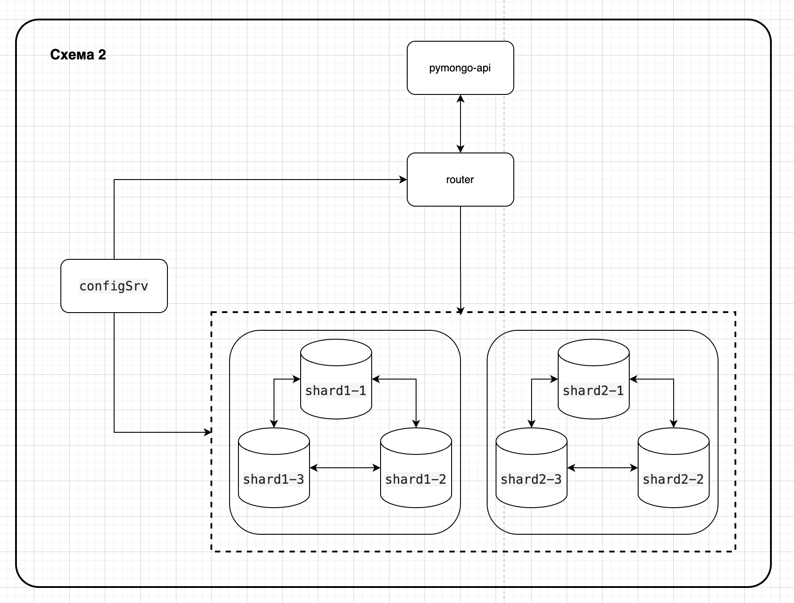

# pymongo-api



## Как запустить

Развернуть приложение, настроить базу и заполнить ее данными:

```shell
make start
```

Остановить и очистит все контейнеры

```shell
make stop
```

Развернуть все контейнеры (mongodb и приложение)

```shell
make run-containers
```

Инициализированить базу данных

```shell
make init-db
```

Добавить пользователей

```shell
make add-users
```

## Как проверить

Сумма клиентов расположенных на двух шардах ровна COUNT_USERS(по умолчанию 100)

```shell
make test
```
